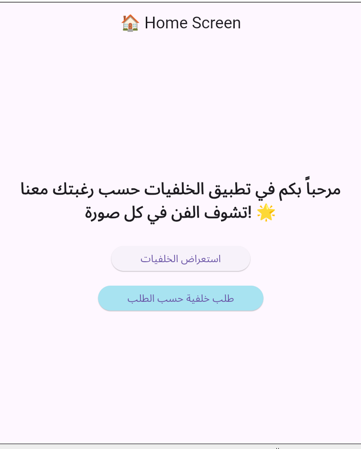
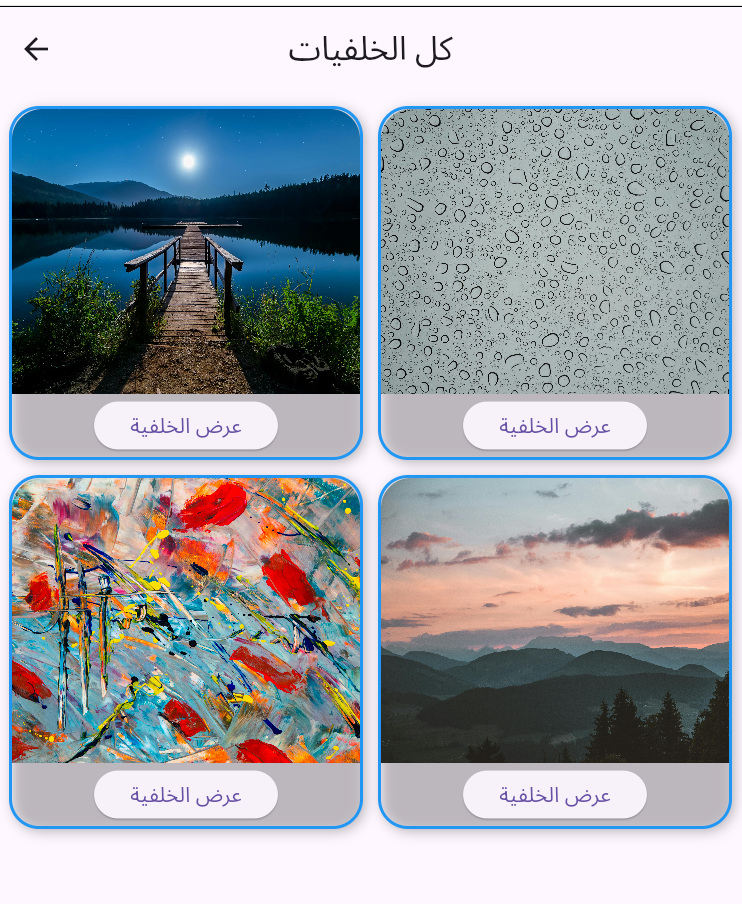
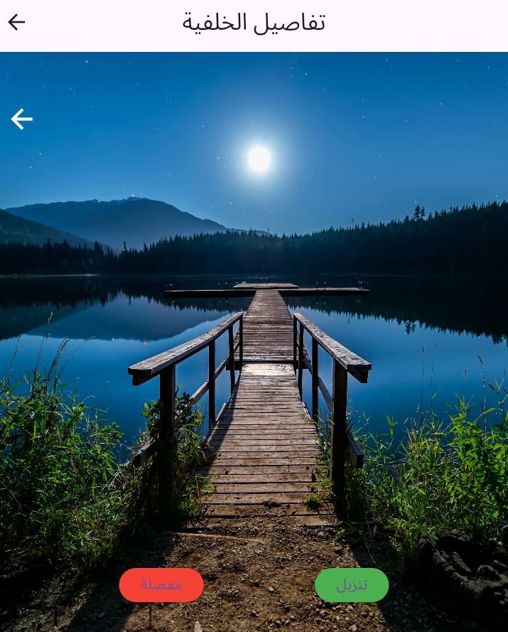
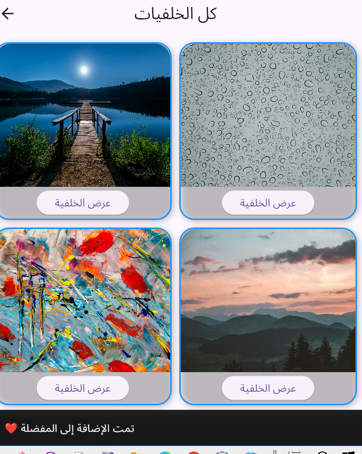

# exerciseFlutter1+2

## Project Idea
هذ التطبيق فكرته عرض خلفيات تم تصميمة من اجل  التمرينين المطلوبين  تنفيذهما  تم عمل النشاطين ك مشروع واحد يؤدي عمل :(Basic Stack Navigation + Passing and Returning Data) 
و تم شرح التمرينين مع عرض صور المخرجات كا التالي:

---------------------------------------------------------------------------------------------------------------------------------------------------------------------------------------
## First: Basic Stack Navigation

شرح المكدس يتم تكديس الصفحات فوق بعض "push" ,اذا تم الرجوع عملية "pop " الى الصفحة التالية

### اولا عند تشغيل التبيق
Stack:
HomeScreen

### ثانيا عند الضغط على استعراض الخلفيات

Navigator.push()

Stack:
HomeScreen
WallpapersScreen

### ثالثا عند الضغط على تفاصيل 

Navigator.push()

Stack:
HomeScreen
WallpapersScreen
DetailScreen

### رابعا الرجوع من ششاشة التفاصيل

Navigator.pop()

Stack:
HomeScreen
WallpapersScreen

### خامسا الرجوع من شاشة كل الخلفيات الى الشاشة الرئيسية

Navigator.pop()

Stack:
HomeScreen

## Screenshots (Navigation)

Home Screen

Wallpapers Screen

Detail Screen

---------------------------------------------------------------------------------------------------------------------------------------------------------------------------------------

## Second: Passing and Returning Data

### Passing Data (إرسال البيانات)

تم إرسال رابط الصورة إلى شاشة التفاصيل:

MaterialPageRoute(
  builder: (context) => DetailScreen(
    imageUrl: wallpapers[index],
  ),
);

### Returning Data 

عند الضغط على زر اضافة للمفضلة او تنزيل:

Navigator.pop(context, "تمت الإضافة إلى المفضلة");
ومن ثم يفعل pop hgn hgwti hgshfrm wtpm ;g hgogtdhj
-

### Receiving Data 

final result = await Navigator.push(...);

if (result != null) {
  ScaffoldMessenger.of(context).showSnackBar(
    SnackBar(content: Text(result)),
  );
}

-------------------------------------------------------------------------------------------------------------------------------------------------------------------------------

## Screenshots (Passing Data)

Detail Screen

Result Message

## Author

اسم الطالب:جلال وديع عبد الغني حميد
